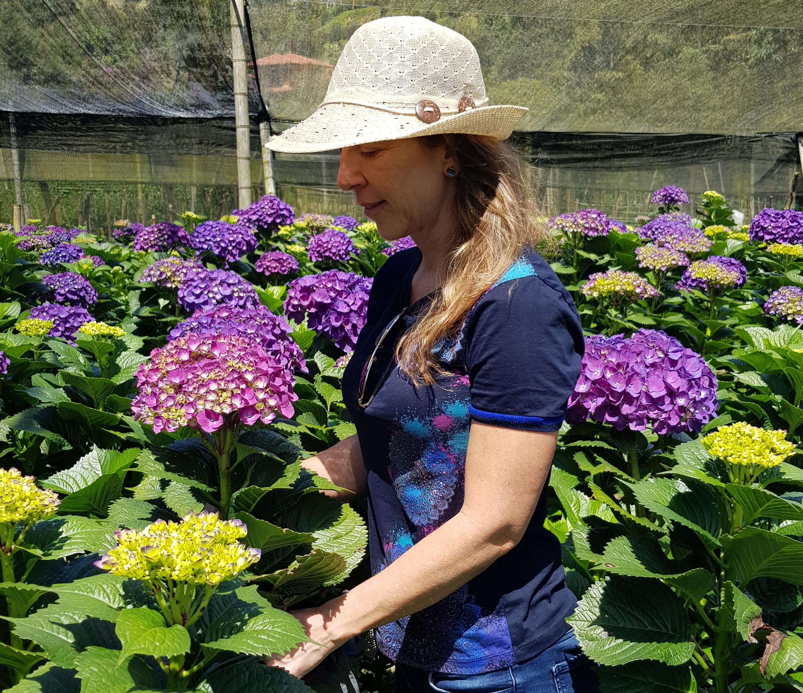

	<h2 class="section-heading text-uppercase">About Us</h2>

 

{:height="100%" width="100%"}

####  Andean Bouquet’s history

Andean Bouquet’s history Andean Bouquet was founded in 2001 by Hebert Varela, owner and manager, and a group of interdisciplinary professionals specialized in production, logistics, marketing and administration, gathering almost 14 years experience in the cut flower industry. Today, Andean Bouquet has become a well established and solid company focused mostly on growing and exporting cut hydrangeas.

Our team’s knowledge of the flower industry and Colombia’s exceptional conditions for flower growing, such as high mountain climates and almost non-changing number of light hours/day and temperatures all year long, which make our country a unique place to grow flowers efficiently, has made our company a leader in the cut hydrangea flower business.

At Andean Bouquet, we have been working to build long lasting and strong commercial relationships with our customers because we believe in mutual benefit and because we know that together we can better find new ways to make people happy with nature’s beautiful gift: flowers!

 
{:height="100%" width="100%"}

####  Mission

Our goals are to always have happy customers with our beautiful, fresh and consistent high-quality cut flowers delivered on time to our customers by our team and to always maintain the well-being of our staff and surroundings by being socially and environmentally conscious.

####  Vision

We want to continue being a fair, responsible and reliable company for our customers and all the members of our team. We want to continue consolidating our commercial relationships by keeping the highest quality standards to which our customers are used to and by offering them innovative products to fulfill their needs. We want to grow as a company by reaching new markets and learning from them to make our production processes comply with different market standards throughout the world.

#### Core values

- Long-lasting relationships with our customers
- Happy and dedicated staff
- Focus on wholesalers
- Consistency in high-quality cut flowers
- Optimal customer service
- Social and Enviromental responsability