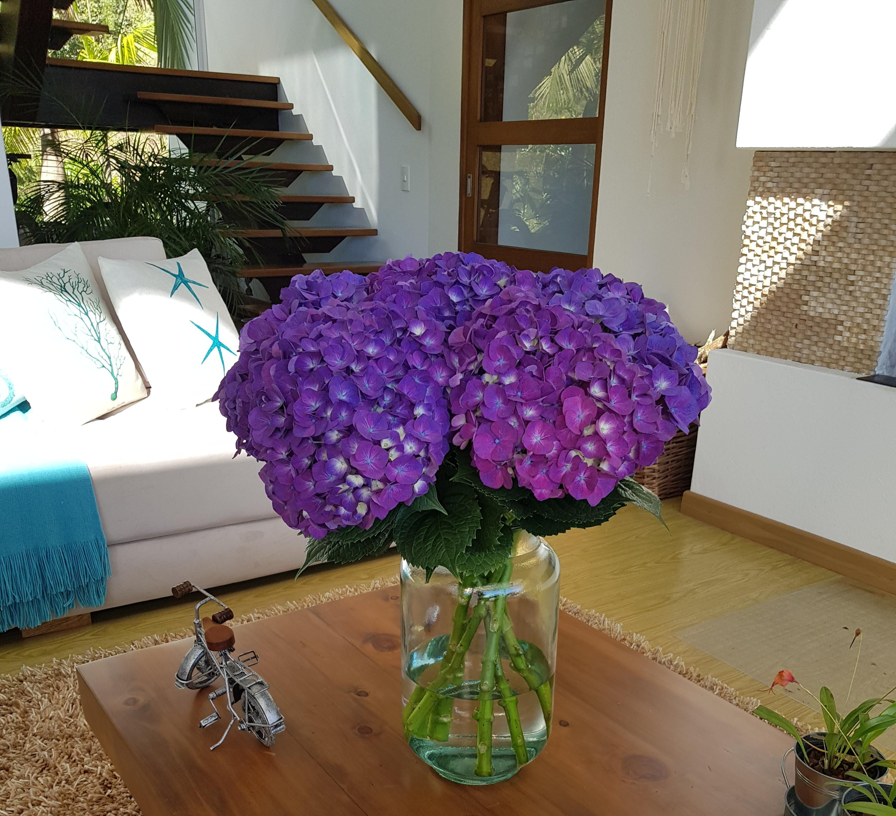
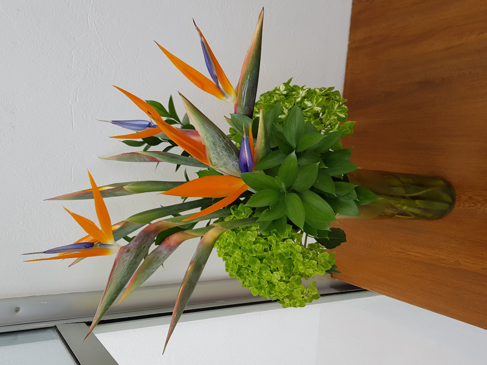

	<h2 class="section-heading text-uppercase">Product Care</h2>

The best tips to care after your flowers.

{:height="100%" width="100%"}

####  Cut Hydrangea Care
1. Take off the plastic sleeve.
2. Cut stems at a 45-degree angle underwater in a bucket.
3. Leave them hydrating for 5 minutes.
4. Place flowers in a clean vase.
5. Mist petals with a spray of clean water every other day to avoid dehydration.
6. Make sure the vase always has water above the cut stem level.
7. Change vase water and re-cut stems every 3 days.
8. If any flower wilts, submerge entirely the flower head in the water and place it in the vase again. It will revive!
9. Keep flowers out of direct sunlight and away from heat and drafts.

{:height="100%" width="100%"}

<!-- #### Antique Hydrangeas

The Antique Hydrangeas endure a long time in the crop. These flowers are exposed to different weather conditions and aging of the flower for a longer time than other hydrangeas, this is why they may show pink spots, different range of colors such as light green, dark green, and, sometimes, brown spots. Please do not mind these variations, they are part of the antique aging process of the flowers, and this is what makes them so unique and special. -->

#### Bird-of-Paradise
Bird-of-Paradise is a special kind of flower; it has up to 3 consecutive blooms. When the first bloom has worn out, do not be afraid to tear it off; behind comes the other! It is a magical flower that will make your arrangements last longer than most other flowers.

Note, if the petals do not show for one or two days, try to open the natural overture on the top of the flower and slightly pull the orange petal just a little, to help it bloom.
